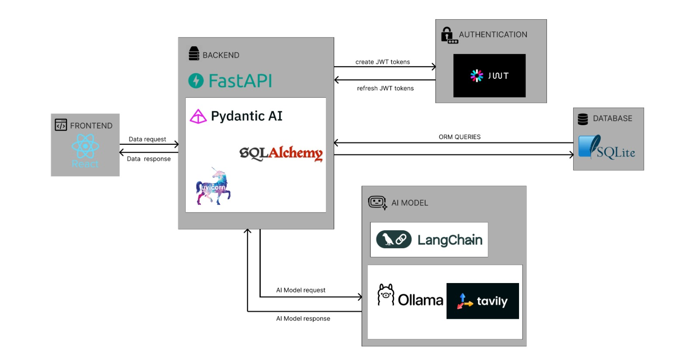

# Project Setup & Download Instructions

## Prerequisites

- Git
- Node.js (v18 or higher)
- npm
- Python (v3.10 or higher)
- uv (Python package manager)
- Ollama

---

## Step 1: Clone the Repository

```bash
git clone https://github.com/Omkar96-18/AIChatApplication.git
cd AIChatApplication
```

## Step 2: Frontend Setup
```bash
cd frontend
npm install
cd ..
```

## Step 3: Backend Setup
```bash
cd backend
uv add -r requirements.txt
```

## Step 4: Install Ollama

Download and install Ollama from:
https://ollama.com
Verify installation:

```bash
ollama --version
```

## Step 5: Download LLM Model
```bash
uv run ollama pull llama3:8b-instruct_q4_k_m
```

## Step 6: Environment Configuration (Optional)
Create a .env file inside the backend directory:

```bash
MODEL_NAME=llama3:8b-instruct_q4_k_m
OLLAMA_HOST=http://localhost:11434
```

## Step 7: Run Backend
```bash
uv run python main.py
```

## Step 8: Run Frontend
Open a new terminal and run:
```bash
cd frontend
npm run dev
```

## Step 9: Access Application

**Frontend: http://localhost:3000**
**Backend: http://localhost:8000**

# Tech Stack and Workflow for above project




